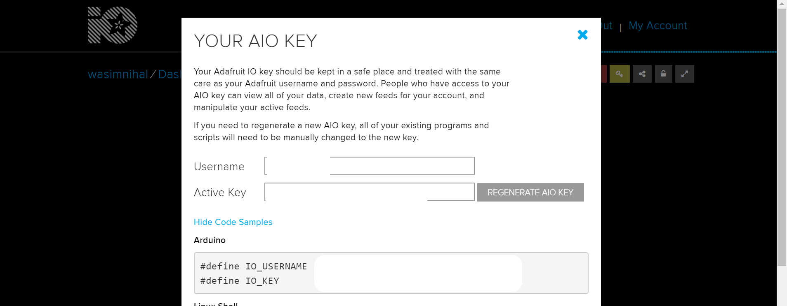

# IoT-using-DHT11-and-io.adafruit
This project will tell you how to sense the temperature and humidity of the surrounding and send the data to an IoT platform.

Components required:
1.Node MCU(ESP8266)
2.DHT 11 Sensor
3.Jumper wires

Step 1: Create a account on https://io.adafruit.com/

Step 2: Click on 'Welcome Dashboard'
        Now your Welcome Dashboard looks something like this.
        
        Click on the key icon to know your Active Key.
        
        

Step 3: Make the connections as follows
   
       
 i.    Connect the Vcc pin if the DHT 11 sensor to Vin(5V) pin  and Gnd pin of DHT 11 to the Gnd pin of your Node MCU Board. 
 
       
       
       
       
       
 ii.   Now connect the Data Pin of the DHT 11 Sensor to pin D2 of the Node MCU Board.
 
        
        
        
        
        
 iii.  Finally connect the micro USB cable to your Node MCU from PC.
        
        
 iv.   That's all the connection part!!!!

Step 4: Open the Arduino IDE and paste the given code.

Step 5. In the config.h file replace IO_USERNAME and IO_KEY to your user name and Active Key respectively and also enter your WiFi username and password in WIFI_SSID and WIFI_PASS respectively.

Step 6. Now complie the code into your Node MCU.

Step 7: Go to the Welcome Dashboard and click on '+' icon(Create a new block) --> Line graph --> select 'temp' feed and click next.

Step 8: Now repeat the above step for 'humid' feed.

Step 9: Finally upload the code into the Node MCU.

Step 10: Go to your Dashboard and notice the graphical view of temperature and humidity.

        
